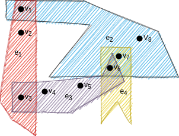

# FastPartitioner

Table of Contents
----------------
* [Hypergraph Definition](#hypergraph)
* [Hypergraph Partitioning](#partitioning)
* [Partitioning Metrics](#metrics)
   * [Cut Net](#met_cn)
   * [Total Volume(k-1, connectivity - 1)](#met_tv)
   * [Total Send Message](#met_tm)
   * [Maximum Send Message](#met_msm)
   * [Maximum Send Volume](#met_msv)
   * [Maximum Send Received Volume](#met_msrv)
* [Requirements Before Build](#reqs)
* [How to Build FastPartitioner](#build)

<a name="hypergraph"> Hypergraph Definition</a>
----------------
A *hypergraph* **H = (V, N)** is defined as a set of vertices **V** and a set of nets
(hyperedges) **N** among those vertices. A net n ∈ N is a subset of vertices and
the vertices in n are called its **pins**.

    
    Figure 1: A hypergraph representation with 4 nets (edges) 
    <b>(N1, 
    N2, 
    N3, 
    N4)</b>
    and 8 vertices 
    <b>(v1, v2, v3, v4, v5,v6,v7,v8)</b>. 
    Pin sets of the nets are given below.
     
      N1 = {v1, v2, v3}
       
      N2 = {v1, v6,
      v7, v8}  
      N3= {v3, v4, v5} 
      N4= {v6,v7} 
        
  

<a name="partitioning"> Hypergraph partitioning</a>
----------------
A K-way partition of a hypergraph H is a partition of its vertex set, which
is denoted as &prod; = {V1, V2, . . . , Vk}, where  
• parts are pairwise disjoint, i.e., Vk &cap; Vl = &empty; for all 1 &le; k &le; l &le; K 
• each part Vk is a nonempty subset of V, i.e., Vk &sube; V and Vk &ne; &empty; for 1  &le;  k &le;  K, 
• the union of K parts is equal to V,  

Let Wk denote the total vertex weight in Vk, that is Wk = &sum; v&isin;Vk w[v] and Wavg denote the weight of each part when the total vertex weight is equally distributed, that is Wavg = &sum; v&isin;Vk w[v] / K. If each part Vk &isin; Π satisfies the balance criterion   
Wk &le; Wavg(1 + ε), for k = 1, 2, . . . , K  
We say that Π is ε-balanced where ε is called the maximum allowed imbalance
ratio.

    
     Figure 2: A partitioning result of a hypergraph with 4 nets <b>(N1, N2, N3, N4)</b>  and 8 vertices <b>(v1, v2, .., v8)</b> into <b>4</b> parts. Resulting partitions are given below. 
     P1 = {v1, v2} 
     P2 = {v3, v4, v5} 
     P3= {v6, v7, v8} 
      
           
  

  

<a name="metrics"> **Partitioning Metrics** </a>
----------------
Quality of the hypergraph partitioninig problem is evaluated based on different metrics. These metrics are generally based on the connectivity of the hypernets after the partitioning. One can find detailed information about the metrics that we are interested in this project below.

<a name="met_cn"> **Cut Net** </a>

Cut net is the total number of hypernets that have connectivity values more than 1(Basically connected to more than 1 partition).

<a name="met_tv"> **Total Volume(k-1, connectivity - 1)** </a>

Total volume is the most popular metric in the literature. It's calculated over a sum of connectivity values of the edges with substracting 1 from them. It's also called k-1 or connectivity - 1 for that reason.

<a name="met_tm"> **Total Message** </a>

Total message is a metric that based on  possible communication requirements between the partitions. Each net has a special vertex in it's vertex set called the <b>source node</b> and all the other nodes of it called <b>target nodes</b>. We say a <b>message</b> is sent from partition of a source node of a net to it's partitions of it's target nodes. Then total message is the total number of different communication pairs among the partitions.

<a name="met_msm"> **Maximum Send Message** </a>

Maximum send message is the number of messages that is send by the part which sends the most messages. Algorithms for this metric focuses on removing the bottleneck which caused by some processor by being responsible for most of the communication between the parts.

<a name="met_msv"> **Maximum Send Message** </a>

Maximum send volume is the cost that is caused by the part which has the source nodes of nets that causes the most connections between the parts when they summed . Algorithms for this metric focuses on removing the bottleneck which caused by some processor by being responsible for most of the communication over the nets.

<a name="met_msrv"> **Maximum Send Message** </a>

Maximum send received volume is the cost that is caused by the part which has the source nodes of nets that causes the most connections between the parts when they summed and in addition to that it's target nodes which causes communication with other parts. Algorithms for this metric focuses on removing the bottleneck which caused by some processor by being responsible for most of the communication over the nets.

<a name="build"> **Build** </a>
FastPartitioner itself can partition and reorder hypergraphs and tensors. Moreover, it can automate experimenting process leveraging other tools. Those tools are Splatt and PaToH. You need to install those tools and their dependencies to fully employ FastPartitioner capabilities. Please note that **FastPartitioner assumes user have a CUDA capable GPU**.

- Install BLAS and LAPACK             
`sudo dnf install blas-devel`       
`sudo dnf install lapack-devel`

- Clone Splatt under `FastPartitioner/`     
https://github.com/ShadenSmith/splatt

- Download binary distribution of PaToH, unzip and put `patoh` executable under `FastPartitioner/`
https://faculty.cc.gatech.edu/~umit/software.html       

